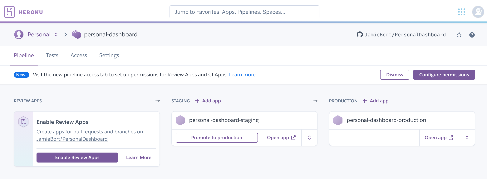

# attempt02

## Purpose

This file is to document what I am doing to deploy and host the project. 

See the [hosting_progress](https://github.com/JamieBort/PersonalDashboard/blob/host/hosting_progress/README.md) README.md file for more information.

~~My first attempt is to host the front end on heroku in one "account" or "project". And to do the same for the back end. So that they are separated from each other.~~ 

This has changed. I now see that Heroku has a pipeline feature. I am now going to attempt to get `~/Documents/DevFiles/personal_projects/PersonalDashboard/` all uploaded in one "account" or "project.

To this end I am attempting to get just the front end working. And for that I am first using `Create and Deploy React App on Heroku - Step by Step Guide YouTube video.` (Under `react on heroku` from https://github.com/JamieBort/PersonalDashboard/blob/react_js/Progress.md#research) and this [Automate your create-react-app build on Heroku using Buildpack](https://medium.com/@antonybudianto/automate-your-create-react-app-build-on-heroku-using-buildpack-beb77408ffee) article.

NOTE: I attempted to learn more about the Heroku pipeline process. Hence this: https://dashboard.heroku.com/pipelines/f6714a28-2872-4d49-a017-502e755a5a6b


## Status

In `~/Documents/DevFiles/personal_projects/old_personal_dashboard_frontend_practice/personal_dashboard_frontend_practice4/frontend`
run `npm install`
run `npm audit fix`
run `cd ~/Documents/DevFiles/personal_projects/old_personal_dashboard_frontend_practice/personal_dashboard_frontend_practice4/`
run `git init`
run `cd frontend/`
run `heroku create version4-personal-dash-front --buildpack https://github.com/mars/create-react-app-buildpack.git`
run `cd ..`
run `git add .`
run `git commit -m "First commit. Version 4. Using 'git subtree push --prefix frontend heroku master'"`

run `heroku git:remote -a version4-personal-dash-front`

~~run `git push heroku master`~~
git subtree push --prefix frontend heroku <branch>:master
run `git subtree push --prefix frontend heroku master`


---

`~/Documents/DevFiles/personal_projects/old_personal_dashboard_frontend_practice/` currently contains
* `personal_dashboard_frontend_practice1/`, 
* `personal_dashboard_frontend_practice2/`, and
* `personal_dashboard_frontend_practice_base/`

a)
`personal_dashboard_frontend_practice_base/` is a copy of `~/Documents/DevFiles/personal_projects/PersonalDashboard/frontend/`. 

However 
* `yarn.lock` has been removed.
* `node_modules` has been removed.
* `npm install` needs to be run in order to load/create `node_modules` again.
* Do NOT create a `yarn.lock` file. Heroku throws an error when there is a `yarn.lock` file and `package-lock.json` file.

b)
`personal_dashboard_frontend_practice1/` worked. 

This is the result of that: https://dashboard.heroku.com/apps/personal-dashboard-frontend

Followed [these instructions](https://medium.com/@antonybudianto/automate-your-create-react-app-build-on-heroku-using-buildpack-beb77408ffee) (also linked above at the end of `Purpose`.)
```
create-react-app $APP_NAME
cd $APP_NAME
git init
heroku create $APP_NAME --buildpack https://github.com/mars/create-react-app-buildpack.git
git add .
git commit -m "Start with create-react-app"
git push heroku master
heroku open
```
in the `/personal_dashboard_frontend_practice1/frontend` directory.

**NOTE:** need to get this working from `/personal_dashboard_frontend_practice1/`, not from `/personal_dashboard_frontend_practice1/frontend`. 

Hence `c)` below and creating the `personal_dashboard_frontend_practice2/` directory.

c)
I am still working on `personal_dashboard_frontend_practice2/`. It didn't work yet.

This https://dashboard.heroku.com/apps/personal-dashboard-frontend2

is the result of following the same instructions as in `b)` above. 

Specifically, [these instructions](https://medium.com/@antonybudianto/automate-your-create-react-app-build-on-heroku-using-buildpack-beb77408ffee) 
```
create-react-app $APP_NAME
cd $APP_NAME
git init
heroku create $APP_NAME --buildpack https://github.com/mars/create-react-app-buildpack.git
git add .
git commit -m "Start with create-react-app"
git push heroku master
heroku open
```

When I run `git push heroku master` 
* in this `~/Documents/DevFiles/personal_projects/old_personal_dashboard_frontend_practice/personal_dashboard_frontend_practice2` directory 
* and again in this `/Documents/DevFiles/personal_projects/old_personal_dashboard_frontend_practice/personal_dashboard_frontend_practice2/frontend/` directory

I receive this response
```
fatal: 'heroku' does not appear to be a git repository
fatal: Could not read from remote repository.

Please make sure you have the correct access rights
and the repository exists.
```

**NOTE:** use `heroku logs --tail` to read the logs

(After doing a bit of research) I believe a solution might be to us `git subtree`.

`Solution 1` in [Deploying subdirectory projects to Heroku](https://jtway.co/deploying-subdirectory-projects-to-heroku-f31ed65f3f2) said to use `git subtree push --prefix path/to/app-subdir heroku master`. (found from [heroku create inside directory](https://www.google.com/search?q=heroku+create+inside+directory&oq=heroku+create+inside+directory&aqs=chrome..69i57.5107j0j7&sourceid=chrome&ie=UTF-8) internet search)
There is a second solution to consider.

Need to research 
* using the `git subtree push --prefix path/to/app-subdir heroku master` command.
    * [Deploy Git subdirectory to Heroku](https://medium.com/@shalandy/deploy-git-subdirectory-to-heroku-ea05e95fce1f) medium article **<-- look at this.**
        * found from [git subtree push --prefix path/to/app-subdir heroku master](https://www.google.com/search?q=git+subtree+push+--prefix+path%2Fto%2Fapp-subdir+heroku+master&oq=git+subtree+push+--prefix+path%2Fto%2Fapp-subdir+heroku+master&aqs=chrome..69i57j69i64.767j0j7&sourceid=chrome&ie=UTF-8) internet search
    * [How to push to git subtree?](https://stackoverflow.com/questions/42026669/how-to-push-to-git-subtree) stack overflow
        * found from [git subtree push --prefix](https://www.google.com/search?q=git+subtree+push+--prefix&oq=git+subtree+push+--prefix&aqs=chrome..69i57j69i64.613j0j7&sourceid=chrome&ie=UTF-8) internet search
    * [Heroku deploy a sub directory?](https://stackoverflow.com/questions/26241683/heroku-deploy-a-sub-directory) stack overflow
        * found from [heroku subdirectory](https://www.google.com/search?q=heroku+subdirectory&oq=heroku+subdirectory&aqs=chrome..69i57j69i60l3.4059j0j7&sourceid=chrome&ie=UTF-8) internet search
    * [How can I deploy/push only a subdirectory of my git repo to Heroku?](https://stackoverflow.com/questions/7539382/how-can-i-deploy-push-only-a-subdirectory-of-my-git-repo-to-heroku) stack overflow
        * found from [heroku subdirectory](https://www.google.com/search?q=heroku+subdirectory&oq=heroku+subdirectory&aqs=chrome..69i57j69i60l3.4059j0j7&sourceid=chrome&ie=UTF-8) internet search
* The buildpack might be the issue; specifically the location or config. research subtree first. However this might come into play:
    * [Configuration](https://github.com/heroku/heroku-buildpack-static#configuration) section of GitHub documentation. (found from https://elements.heroku.com/buildpacks/mars/create-react-app-buildpack)